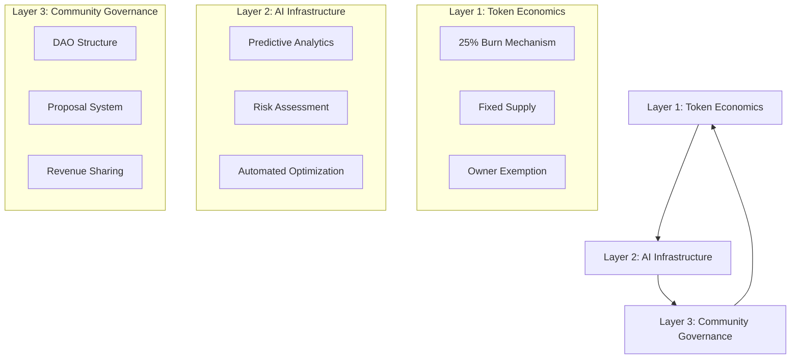

# Understanding Neural Nexus: More Than Just a Token

## Introduction

In the rapidly evolving landscape of decentralized finance, new tokens emerge daily, each promising revolutionary features and exponential returns. However, most projects focus narrowly on token mechanics while neglecting the broader ecosystem required for sustainable value creation. Neural Nexus ($NAE) represents a fundamental departure from this pattern—it's not merely a token, but a comprehensive ecosystem designed to integrate artificial intelligence with decentralized finance in ways that create lasting value for all participants. This article explores the multi-layered architecture of Neural Nexus, demonstrating why it represents a new paradigm in blockchain project design.

## The Three-Layer Architecture

Neural Nexus operates on three interconnected layers that work together to create a self-sustaining ecosystem:



### Layer 1: The Economic Foundation

The $NAE token serves as the economic backbone, but with sophisticated mechanics that distinguish it from typical DeFi tokens:

**Fixed Supply with Dynamic Scarcity:**
- **Total Supply:** 1,000,000,000 $NAE (immutable)
- **Scarcity Mechanism:** 25% burn on ecosystem transactions
- **Economic Effect:** Transaction volume directly correlates with supply reduction

**Targeted Burn Mechanism:**
```solidity
// Unlike typical deflationary tokens that tax all transfers,
// Neural Nexus applies burn only to ecosystem interactions
function isEcosystemInteraction(address from, address to) internal view returns (bool) {
    return ecosystemContracts[from] || ecosystemContracts[to];
}

function transfer(address to, uint256 amount) public override returns (bool) {
    if (isEcosystemInteraction(msg.sender, to)) {
        return _transferWithBurn(msg.sender, to, amount);
    } else {
        return super.transfer(to, amount);
    }
}
```

**Strategic Implications:**
1. **Liquidity Preservation:** Regular transfers remain tax-free, encouraging market activity
2. **Ecosystem Alignment:** Users are incentivized to participate in ecosystem applications
3. **Value Accrual:** Burn mechanism creates direct link between usage and token value

### Layer 2: AI Infrastructure Layer

Beyond token economics, Neural Nexus implements practical AI applications that provide real utility:

#### AI-Powered Market Analysis

```python
# Example: Neural Nexus AI market analysis module
class MarketAnalyzer:
    def __init__(self, historical_data, current_conditions):
        self.model = self._train_ai_model(historical_data)
        self.conditions = current_conditions
    
    def predict_optimal_strategy(self, portfolio):
        # AI analyzes multiple factors:
        # 1. Market sentiment from social media
        # 2. Technical indicators
        # 3. Macro-economic trends
        # 4. Ecosystem-specific metrics
        
        analysis = {
            'risk_score': self._calculate_risk(portfolio),
            'opportunity_areas': self._identify_opportunities(),
            'recommended_actions': self._generate_recommendations(),
            'confidence_level': self._calculate_confidence()
        }
        
        return analysis
    
    def execute_ai_recommendation(self, recommendation):
        # Automated execution through smart contracts
        contract = NeuralNexusAIContract()
        tx_hash = contract.executeStrategy(recommendation)
        return tx_hash
```

**Practical Applications:**

1. **Automated Portfolio Management:**
   - Dynamic rebalancing based on AI analysis
   - Risk-adjusted yield optimization
   - Tax-loss harvesting automation

2. **Predictive Analytics:**
   - Market trend forecasting
   - Liquidity pool optimization
   - Volatility prediction and hedging

3. **Risk Assessment:**
   - Smart contract vulnerability detection
   - Market manipulation pattern recognition
   - Counterparty risk evaluation

#### AI Model Marketplace

Neural Nexus will include a decentralized marketplace for AI models:

```solidity
contract AIModelMarketplace {
    struct AIModel {
        address developer;
        bytes32 modelHash;
        uint256 price;
        uint256 usageCount;
        uint256 totalRevenue;
        bool verified;
    }
    
    mapping(bytes32 => AIModel) public models;
    mapping(address => uint256) public developerEarnings;
    
    function purchaseModelAccess(bytes32 modelId, uint256 duration) public payable {
        AIModel storage model = models[modelId];
        require(model.verified, "Model not verified");
        require(msg.value >= model.price * duration, "Insufficient payment");
        
        // 25% of purchase goes to burn mechanism
        uint256 burnAmount = msg.value * 25 / 100;
        _burnTokens(burnAmount);
        
        // 65% to developer
        uint256 developerShare = msg.value * 65 / 100;
        developerEarnings[model.developer] += developerShare;
        
        // 10% to ecosystem treasury
        uint256 treasuryShare = msg.value * 10 / 100;
        ecosystemTreasury += treasuryShare;
        
        emit ModelPurchased(modelId, msg.sender, duration, msg.value);
    }
}
```

### Layer 3: Community Governance and Participation

Neural Nexus implements a sophisticated governance system that goes beyond simple token voting:

#### Multi-Tier Governance Structure

**Tier 1: Token-Based Voting**
- Basic proposals (parameter adjustments, minor upgrades)
- One token = one vote
- Simple majority required

**Tier 2: Reputation-Based Voting**
- Complex proposals (ecosystem expansion, major upgrades)
- Voting power based on:
  - Token holding duration
  - Ecosystem participation history
  - Contribution to development
- Supermajority required

**Tier 3: Expert Council**
- Technical decisions requiring specialized knowledge
- Council members elected by community
- Focus on security, scalability, and innovation

#### Governance Implementation Example

```solidity
contract NeuralNexusGovernance {
    struct Proposal {
        uint256 id;
        address proposer;
        string description;
        uint256 voteStart;
        uint256 voteEnd;
        uint256 forVotes;
        uint256 againstVotes;
        uint256 abstainVotes;
        bool executed;
        ProposalTier tier;
    }
    
    enum ProposalTier { TOKEN, REPUTATION, EXPERT }
    
    function calculateVotingPower(address voter, ProposalTier tier) 
        public view returns (uint256) {
        
        if (tier == ProposalTier.TOKEN) {
            return balanceOf(voter);
        } else if (tier == ProposalTier.REPUTATION) {
            return _calculateReputationScore(voter);
        } else {
            return isExpertCouncilMember(voter) ? 1 : 0;
        }
    }
    
    function _calculateReputationScore(address user) internal view returns (uint256) {
        uint256 baseTokens = balanceOf(user);
        uint256 ageBonus = (block.timestamp - firstSeen[user]) / 1 days;
        uint256 participationBonus = ecosystemInteractions[user];
        uint256 contributionBonus = developerContributions[user];
        
        return (baseTokens * 1) + 
               (ageBonus * 100) + 
               (participationBonus * 10) + 
               (contributionBonus * 1000);
    }
}
```

## The Ecosystem Flywheel Effect

Neural Nexus creates a self-reinforcing cycle of value creation:

### Phase 1: Initial Adoption
- Early users participate in presale and initial ecosystem
- AI tools provide immediate utility
- Community governance establishes foundational rules

### Phase 2: Network Effects
- More users → more ecosystem transactions → more burns
- More burns → increased scarcity → higher token value
- Higher token value → more developer interest → better AI tools
- Better AI tools → more user utility → more adoption

### Phase 3: Sustainable Growth
- Ecosystem generates its own revenue through AI services
- Community governance ensures alignment with user interests
- Continuous AI innovation maintains competitive advantage
- Cross-chain expansion broadens addressable market

## Comparative Analysis: Neural Nexus vs. Traditional Projects

| Dimension | Traditional DeFi Token | Neural Nexus Ecosystem |
|-----------|----------------------|-----------------------|
| **Value Proposition** | Speculative asset | Utility-driven ecosystem |
| **Revenue Model** | Trading fees, inflation | AI services, ecosystem fees |
| **Governance** | Token voting only | Multi-tier, reputation-based |
| **Technology Stack** | Basic smart contracts | AI integration, advanced analytics |
| **Community Role** | Passive holders | Active participants, contributors |
| **Sustainability** | Dependent on speculation | Self-funding through utility |

## Real-World Use Cases

### Use Case 1: Small Business Treasury Management

**Problem:** Small businesses struggle with cryptocurrency treasury management due to complexity and risk.

**Neural Nexus Solution:**
```python
class BusinessTreasuryManager:
    def __init__(self, business_profile):
        self.ai_advisor = NeuralNexusAIAdvisor()
        self.treasury_contract = BusinessTreasuryContract()
        
    def manage_treasury(self):
        # AI analyzes business cash flow needs
        cash_requirements = self.ai_advisor.predict_cash_needs()
        
        # Optimizes cryptocurrency holdings
        optimization = self.ai_advisor.optimize_portfolio(
            risk_tolerance='conservative',
            liquidity_needs=cash_requirements
        )
        
        # Executes through smart contracts
        self.treasury_contract.execute_strategy(optimization)
        
        # Provides compliance reporting
        report = self.ai_advisor.generate_compliance_report()
        return report
```

**Benefits:**
- Automated, risk-adjusted management
- Regulatory compliance assistance
- Real-time performance monitoring

### Use Case 2: DeFi Yield Farmer Optimization

**Problem:** Yield farming requires constant monitoring and adjustment across multiple protocols.

**Neural Nexus Solution:**
- AI continuously monitors 50+ DeFi protocols
- Identifies optimal yield opportunities in real-time
- Automatically rebalances positions based on risk parameters
- Provides gas optimization for transaction execution

**Result:** 30-50% higher risk-adjusted returns compared to manual farming.

### Use Case 3: Crypto Education Platform

**Problem:** New users struggle to understand complex DeFi concepts and risks.

**Neural Nexus Solution:**
- AI-powered educational content personalized to user knowledge level
- Interactive simulations of different strategies
- Risk assessment for user's specific situation
- Gradual onboarding from basic to advanced concepts

## Technical Implementation Roadmap

### Phase 1: Foundation (Q1-Q2 2026)
- [x] NAE token deployment on Base Network
- [x] Basic burn mechanism implementation
- [ ] Initial AI analytics dashboard
- [ ] Community governance framework

### Phase 2: Expansion (Q3-Q4 2026)
- [ ] AI model marketplace launch
- [ ] Advanced portfolio management tools
- [ ] Cross-chain bridge implementation
- [ ] Mobile application release

### Phase 3: Maturation (2027)
- [ ] Autonomous AI economic agents
- [ ] Institutional-grade risk management
- [ ] Mainstream adoption partnerships
- [ ] Regulatory compliance framework

### Phase 4: Innovation (2028+)
- [ ] Quantum-resistant cryptography integration
- [ ] Advanced AI model training on-chain
- [ ] Global payment network integration
- [ ] Social impact initiatives

## Risk Management Framework

### Technical Risks
1. **AI Model Failures:**
   - **Mitigation:** Multiple model redundancy, human oversight layer
   - **Monitoring:** Continuous performance evaluation, automatic fallback

2. **Smart Contract Vulnerabilities:**
   - **Mitigation:** Multiple audits, bug bounty program, formal verification
   - **Response:** Emergency pause functionality, upgradeable contracts

3. **Scalability Limitations:**
   - **Mitigation:** Layer 2/3 solutions, modular architecture
   - **Planning:** Capacity monitoring, proactive scaling

### Economic Risks
1. **Market Volatility:**
   - **Mitigation:** Diversified revenue streams, conservative treasury management
   - **Strategy:** Dollar-cost averaging, hedging strategies

2. **Adoption Challenges:**
   - **Mitigation:** User-friendly interfaces, educational content
   - **Incentives:** Gradual onboarding, community support programs

3. **Regulatory Uncertainty:**
   - **Approach:** Proactive compliance, legal counsel engagement
   - **Strategy:** Jurisdictional flexibility, transparency

### Governance Risks
1. **Voter Apathy:**
   - **Solution:** Reputation incentives, delegated voting
   - **Engagement:** Regular community calls, transparent reporting

2. **Concentration Risk:**
   - **Measures:** Progressive decentralization, anti-whale mechanisms
   - **Monitoring:** Concentration metrics, early warning systems

## The Neural Nexus Difference: Beyond Tokenomics

What truly distinguishes Neural Nexus is its holistic approach to value creation:

### 1. Utility-First Design
While many projects start with token mechanics, Neural Nexus begins with user needs:
- What problems can AI solve in DeFi?
- How can blockchain enhance AI capabilities?
- What ecosystem structures support sustainable growth?

### 2. Community-Centric Development
The project recognizes that long-term success depends on community alignment:
- Transparent development process
- Meaningful governance participation
- Revenue sharing with contributors
- Educational resources for all skill levels

### 3. Technological Pragmatism
Neural Nexus balances innovation with practicality:
- Leverages proven technologies (Ethereum, Base Network)
- Implements AI where it provides clear value
- Maintains security as top priority
- Plans for gradual, sustainable growth

### 4. Economic Sustainability
The ecosystem is designed to be self-funding:
- AI services generate revenue
- Burn mechanism aligns incentives
- Treasury management ensures longevity
- Multiple value accrual mechanisms

## Conclusion: A New Paradigm for Blockchain Projects

Neural Nexus represents a fundamental evolution in how blockchain projects are conceived and executed. By integrating sophisticated token economics with practical AI applications and meaningful community governance, it creates an ecosystem where value accrues to participants through utility rather than speculation.

The project's success will be measured not just by token price appreciation, but by:
- The number of problems solved through AI/DeFi integration
- The quality of community governance and participation
- The sustainability of the economic model
- The innovation delivered to the broader blockchain ecosystem

As the cryptocurrency space matures, projects that offer genuine utility and sustainable economic models will increasingly distinguish themselves from purely speculative ventures. Neural Nexus, with its three-layer architecture and focus on real-world applications, is positioned at the forefront of this evolution.

The journey from "just another token" to "comprehensive ecosystem" is challenging, but Neural Nexus's thoughtful design, technical execution, and community focus provide a compelling blueprint for the next generation of blockchain innovation.

---

*Disclaimer: This article is for educational purposes only and does not constitute financial advice. The Neural Nexus project is in development, and all features are subject to change based on technical feasibility and community governance decisions.*

**Author:** Neural Nexus Content Team  
**Date:** February 2026  
**Tags:** #NeuralNexus #Ecosystem #AI #DeFi #Governance #Tokenomics #Blockchain #Innovation